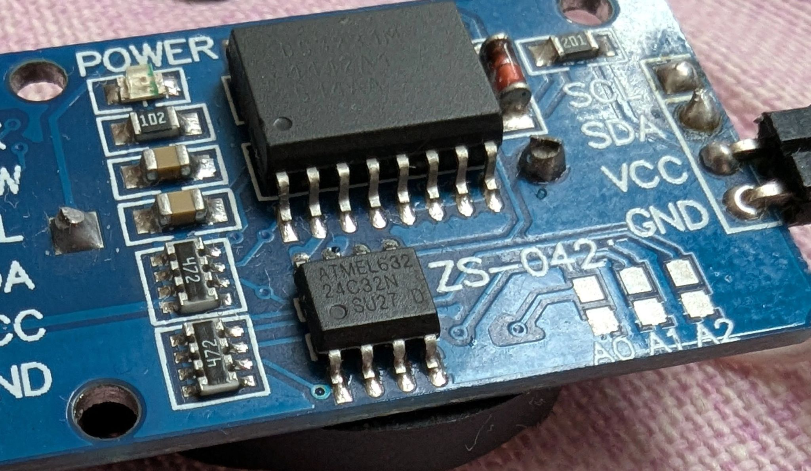

# at24cxx
Lightweight and short library for I2C memory chip AT24Cxx for Arduino (in development).

Function => `bool begin(_i2c_addr)` 
Check connection with at24cxx, return `TRUE` if present and `FALSE` otherwise. Save `_i2c_addr` for further operations. 

Function => `uint8_t read(uint16_t _lv_mem_addr)` 
Return byte from address `_lv_mem_addr`.

Function => `bool write(uint16_t _lv_mem_addr, uint8_t data)` 
Write byte `data` to address `_lv_mem_addr`. After each oeration of write need to make delay.
I probe 10ms. What delay need to different type chips. It should to find info or test manualy.

Function => `bool read_arr(uint16_t _lv_mem_addr, uint16_t _lv_size_dim, char* _lv_dim)` 
Read to `_lv_dim array` of bytes (chars) from memory AT24Cxx starting address `_lv_mem_addr` in amount of `_lv_size_dim`.

Function => `bool write_arr(uint16_t _lv_mem_addr, uint16_t _lv_size_dim, char* _lv_dim)` 
Write from `_lv_dim array` of bytes (chars) to memory AT24Cxx starting address `_lv_mem_addr` in amount of `_lv_size_dim`. 
Note 1: Write to at24cxx can only by pages 32 bytes. Memory address must be aligned to 32 and set to the begin every page,
otherwise it will be rotated inside page = collapse!!! 
Note 2: After each oeration of write need to make delay. I probe 10ms. 
What delay need to different type chips It should to find info or test manualy.

Functions don't use of delay, don't foget make 10ms delay ! afte write command.
It should do it manually for benefits of using FreeRTOS.

I used: 
oficial datasheet ATMEL 2-Wire Serial EEPROM 32K (4096 x 8), 64K (8192 x 8). 
https://lastminuteengineers.com/ds3231-rtc-arduino-tutorial/ 

I tested it only with 1 chinese chip  DS3231 module. :-( 
 

https://www.linkedin.com/posts/ihor-koniuk-146840350_chinese-board-with-ds3231-rtc-on-board-is-activity-7330616390229344258-aMlj?utm_source=share&utm_medium=member_desktop&rcm=ACoAAFewZMYBEfyiDoJClKnjuWzaCT7PkqrGSyI
